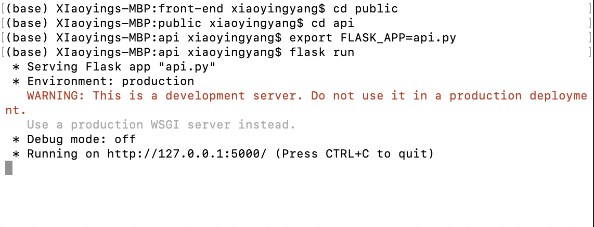
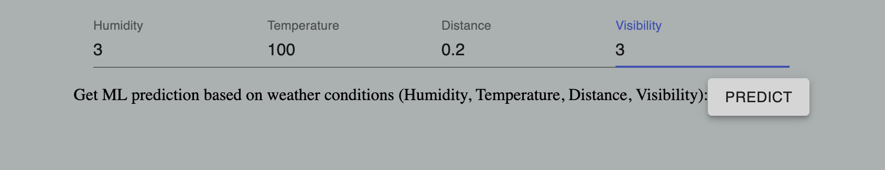
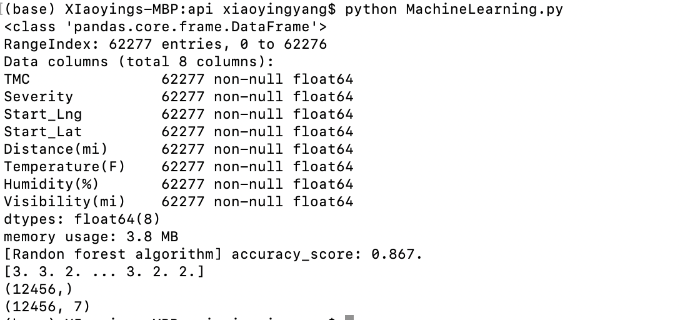

# friendly-pancake
Data Preparation and Setup

Which database system(s) and version(s) are you using? How do we install it/them? (providing a link to official documentation will be enough)

How do we download the data you used for your project? Please do NOT submit ALL the data with your code (Submitting a very small portion (< 5 MB) so that we can run the demo might be okay)

How do we load this data into the database system? 

Do you have some scripts to do that? If yes, how do we execute them?

Did you use some tools for loading? If yes, what are they? Provide appropriate details and links. 

If you are benchmarking different database systems, did you make changes to the configurations? If yes, what are they?

If you are generating your own data, how do we generate it?

Application and code

Which programming language(s) and version(s) are you using (Python, Java 8, C++, etc.)?

For machine learning part, we used python v-3.7.

List the third-party libraries needed to execute your code and how do we install them (For ex. MySQL/neo4j connector for Python)

For machine learning part, we used sklearn to train model; we used pandas and numpy for data framewokr; we used folium to build interactive heatmap; we also used flask to run a web session for machine learning code. 

If you have a GUI, how do we run it?

For machine learning part, you need to open another terminal for new flask session: 
First, in the new terminal, go to front-end/public/API document in terminal, run "export FLASK_APP=api.py" to wrap the code in a flask app. 
Second, in the new terminal, run "flask run", to start running flask. 
Third, in the application interface, find the "Get ML prediction" input box, and enter all parameters in boxes. Then, click "predict". The app will open a new window (sometimes behind the window of the app) which shows an interactive map of the target area. 

Anything else we need to know about running your application?

For the machine learning part, you need to train the model locally, because the pre-trained model is too big to be uploaded on GitHub (about 130Mb). To train a model, you need to go to front-end/public/API and run python script "MachineLearning.py". This will take about 20 seconds to train a model. After having the trained model, you can run the API and start using the machine learning function.

Code Documentation and References

Did you use some code from GitHub or other sources? If yes provide the link.

If you used some online code, what changes did you make to the code?

Give a list of files in your submission which are written by you.

Feel free to include images of your application’s working in Readme/Instructions file.

* before run this project, make sure you have mongodb installed
1. install pip: https://pip.pypa.io/en/stable/installing/
2. under front-end folder run $ pip install -r requirements.txt
3. kaggle authentication api token: https://www.kaggle.com/docs/api 
5. run python mongoUtil.py to download the data into the mongodb
* first run server. under /server, run $ nodemon index.js
* Then under/front-end run $ npm start
* server is listening on 4000 port
* click show button, console will print all counties and ID
* http://localhost:4000/counties will show all counties with ID
* http://localhost:4000/accidents will show fulton accidents but very slow

Code Documentation and References：
https://codesandbox.io/s/usa-counties-choropleth-map-quantile-2gi36?from-embed：reference on how to draw heat map
https://recharts.org/en-US/: reference on how to draw graph, chart ... visualization
https://github.com/kitze/react-electron-example: referenece on how to set up Electron + React application
